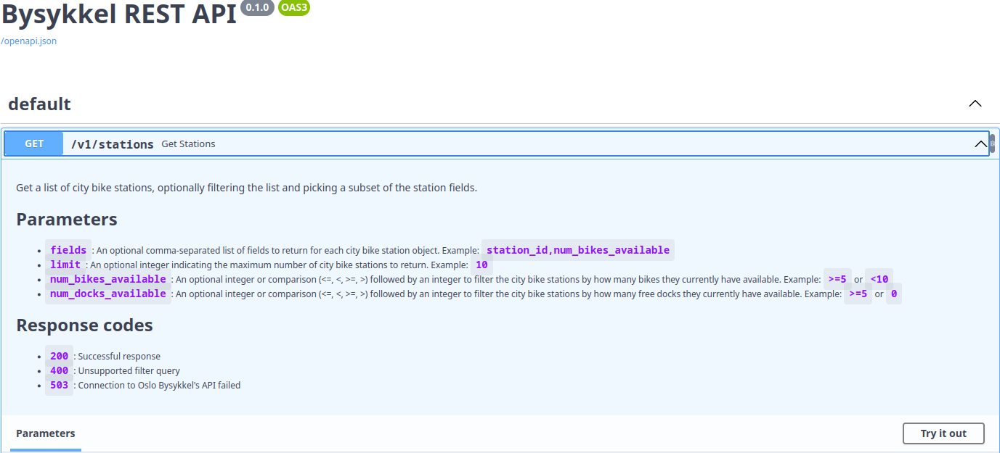

# Bysykkel

`bysykkel` is a small Python project for querying [Oslo Bysykkel's real time API](https://oslobysykkel.no/apne-data/sanntid). It includes a Python library, a CLI and a REST API.

## Project structure

```txt
bysykkel/       # Source code
bysykkel/app    # Source code for the REST API
bysykkel/cli    # Source code for the CLI
tests/          # Unit and integration tests
compose.yml     # Compose file for containerized serving
Dockerfile      # Dockerfile for containerized building
pyproject.toml  # Project manifest
setup.py        # Setuptools shim
```

## Getting started

The project includes a `Dockerfile` and `compose.yml` which can be used for building and serving the REST API. The only requirement is a [Docker](https://www.docker.com/) installation.

To build and serve the REST API, run

```sh
docker compose up --build
```

This spins up a [FastAPI](https://fastapi.tiangolo.com/)-based web application that can be accessed on <http://127.0.0.1:8000>. The web application provides a couple of routes to query Oslo Bysykkel's real time API.

When accessing <http://127.0.0.1:8000>, you'll find a [Swagger UI](https://swagger.io/tools/swagger-ui/) (Open API schema renderer) which provides interactive documentation of the API routes.



You can also find the full OpenAPI schema on [/openapi.json](http://127.0.0.1:8000/openapi.json). The schema can be e.g. be consumed by [Postman](https://www.postman.com/) or an [OpenAPI Generator](https://github.com/OpenAPITools/openapi-generator) to create clients for interacting with the API.

## Tests

The Compose file `tests/e2e/compose.yml` provides a containerized environment for running unit- and end to end tests. To run these tests,

```sh
docker compose -f tests/e2e/compose.yml up --exit-code-from testrunner --build
```

This spins up two containers:

- A server which hosts the REST API
- A test runner which performs requests against the server

## Endpoints

All the endpoints listed below are `GET` endpoints.

| Endpoint           | Description                                                                                                                                          |
| :----------------- | :--------------------------------------------------------------------------------------------------------------------------------------------------- |
| `/v1/stations`     | Get all Oslo Bysykkel stations and their current status. Supports basic filtering: See the [OpenAPI documentation](127.0.0.1:8000/docs) for details. |
| `/v1/station/{id}` | Get a single Oslo Bysykkel station and its status.                                                                                                   |
| `/live`            | Liveness probe                                                                                                                                       |
| `/ready`           | Readiness probe                                                                                                                                      |
| `/docs`            | Swagger UI rendering of the OpenAPI schema                                                                                                           |
| `/openapi.json`    | OpenAPI schema                                                                                                                                       |

For more details on the routes and payload models, please refer to the [OpenAPI documentation](127.0.0.1:8000/docs).

## Local installation: CLI and development

This requires having a recent (>=3.7) Python version installed.

You can perform a local editable installation of the project and dependencies using `pip`:

```sh
python -m pip install -e ".[dev]"
```

This provides an importable Python module `bysykkel`, as well as a CLI command `bysykkel`.
You can then use the CLI for checking the status of Oslo Bysykkel stations by running

```sh
bysykkel list
#                        Bysykler
# Stativ                 Adresse                 # Sykler # Låser
# Marienlyst             Suhms Gate 46A          1        11
# Holbergs plass         Holbergs Plass          0        10
# Stensparken            Sporveisgata            0        15
# Sagene bussholdeplass  Sagene bussholdeplass   0        15
# ....
```

To serve the REST API, run:

```sh
python bysykkel/app/main.py
```

# License

MIT
